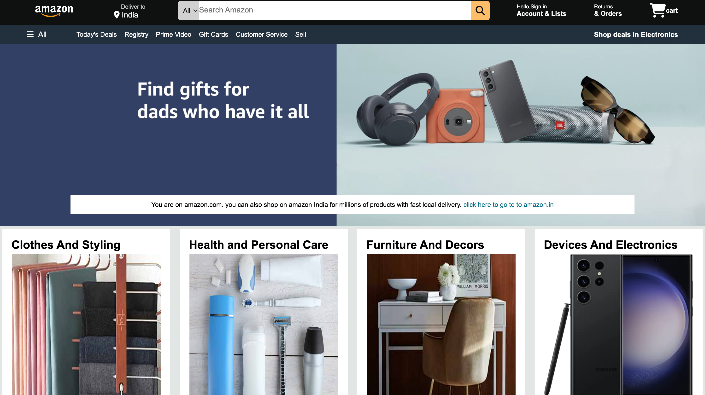
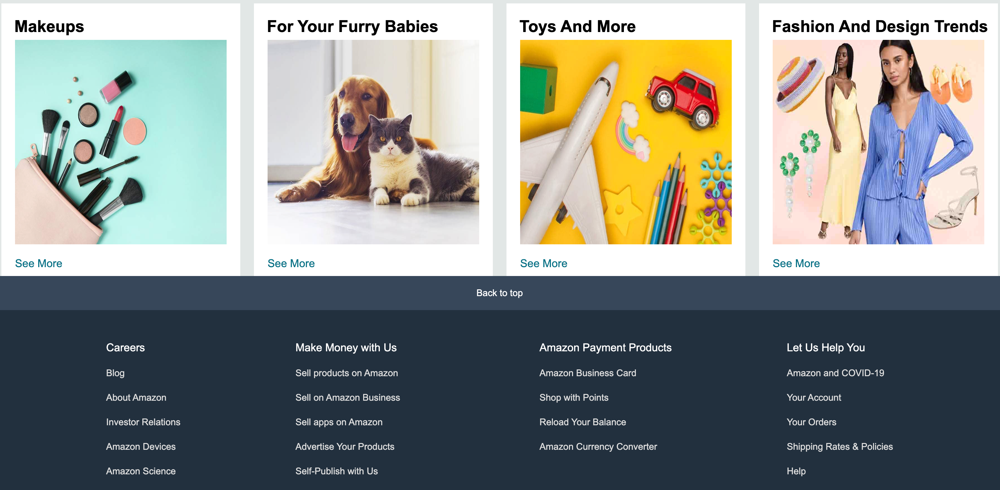

🛍️ Amazon Clone - Frontend Project
A front-end replica of Amazon’s homepage created using HTML and CSS. This project focuses on layout structuring, UI replication, and responsive design techniques to mimic the look and feel of Amazon's official landing page.

[text](<../Screen Recording 2025-06-06 at 6.09.06 PM.mov>)

🔍 Features
✅ Fully responsive navigation bar

🔎 Integrated search bar with custom styling

🛒 Shopping cart icon with hover effects

🎯 Hero section with promotional banner

🧱 Product category grid using CSS Grid

📑 Multi-section footer resembling Amazon’s original structure

✨ Smooth hover effects and modular styling

🛠️ Tech Stack
Technology	Usage
HTML5	Structure and semantics
CSS3	Styling, layout (Flexbox & Grid), responsiveness

📂 Project Structure
php
Copy
Edit
amazon-clone/
├── index.html
├── style.css
├── images/
│   ├── amazon_logo.png
│   └── hero_image.jpg
└── README.md

Navigation Bar	Hero Section	Product Grid	Footer

📌 You can add actual screenshots or remove this section if not applicable.

🚀 Getting Started
Clone the repository:

bash
Copy
Edit
git clone https://github.com/your-username/amazon-clone.git
Navigate to the project directory:

bash
Copy
Edit
cd amazon-clone
Open index.html in your browser:

Either double-click the file

Or use Live Server extension in VS Code

🎯 Purpose
This project was created for practicing:

Front-end layout design

CSS Flexbox and Grid

UI/UX consistency with real-world websites

Clean and maintainable code structure

📌 Author
Sagar Katoch
Second-year student, Jaypee University, Solan (Waknaghat), Himachal Pradesh
LinkedIn | GitHub

📃 License
This project is open source and available under the MIT License.
